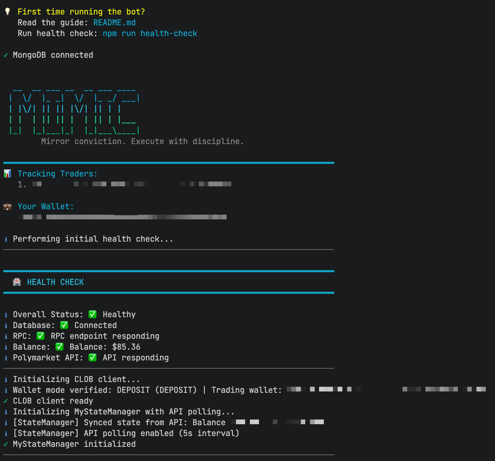

<div align="center">
  <h1>Polymarket Mimic Trading Bot</h1>
  <p><strong>Un nodo de ejecución cuantitativa hardcore: con enrutamiento proxy de Account Abstraction (AA), concurrencia de múltiples billeteras y agregación dinámica de órdenes.</strong></p>
  <p><em><a href="README.md">English</a> | <a href="README.zh-CN.md">中文</a> | <a href="README.ja.md">日本語</a> | <a href="README.ko.md">한국어</a> | <a href="README.es.md">Español</a></em></p>
  <p>
    <a href="LICENSE"></a>
    <a href="https://nodejs.org/"></a>
    <a href="https://polymarket.com/"></a>
    <a href="https://www.mongodb.com/"></a>
  </p>
</div>

## ¿Por qué construir este sistema?

En el campo de batalla de alta frecuencia de Polymarket, los mejores traders ("Smart Money") a menudo ejecutan a través de numerosas micro-operaciones (snipes). Copiar ciegamente 1:1 conduce a un desgaste masivo de gas y a un deslizamiento extremo. Además, la API actualizada de Polymarket exige un flujo de Deposit Wallet basado en Account Abstraction, lo que provoca que las llamadas tradicionales de EOA sean bloqueadas con un error `maker address not allowed`.

**Polymarket Mimic Trading Bot** no es solo un simple envoltorio de API. Es un nodo de ejecución automatizado completo que presenta persistencia de estado, un agregador de órdenes, un motor de control de riesgo dinámico y total compatibilidad con el nuevo mecanismo de enrutamiento Relayer de Polymarket.

### Características principales de la arquitectura

- **Motor de agregación de órdenes**: Establece una ventana de tiempo en memoria (ej., 5 segundos) para agregar snipes fragmentados en el mismo mercado/resultado dentro de un umbral de precio en órdenes por lotes limpias, evitando los límites de tasa y aumentando la eficiencia de ejecución.
- **Riesgo dinámico y escalado de precisión**: Una matriz de estrategia JSON detallada que calcula dinámicamente el tamaño de ejecución en función de su relación de capital, maneja automáticamente los requisitos de Tick Size específicos del intercambio y aplica límites estrictos de deslizamiento.
- **Enrutamiento Proxy AA (Flujo Deposit Wallet)**: Implementa de forma nativa el protocolo de firma `POLY_1271` y la lógica de interacción del Relayer. Mecanismos de validación estrictos aseguran que el modo de ejecución, el estado del contrato en cadena y las variables de entorno estén perfectamente alineados para evitar la pérdida de activos.
- **Máquina de estado y resiliencia**: Todo el ciclo de vida (posiciones, metadatos de órdenes, historial de ejecución) se persiste en tiempo real en MongoDB. Los mecanismos de reintento de red incorporados utilizan algoritmos de retroceso exponencial (Exponential Backoff) para manejar las fluctuaciones de RPC.

## Descripción general de la arquitectura



1. **Monitoreo continuo**: Consulta el flujo de actividad de las direcciones objetivo a través de la Polymarket Data API.
2. **Agregación y limpieza**: Fusiona el ruido de alta frecuencia dentro de una ventana de tiempo en órdenes por lotes ejecutables.
3. **Control de riesgos y escalado**: Calcula el tamaño real de la orden dinámicamente en función del saldo de la cuenta y la matriz de estrategia.
4. **Enrutamiento y validación**: Cambia la lógica de firma subyacente automáticamente en función de `WALLET_MODE`, transmitiendo órdenes a través del Relayer o RPC nativo.
5. **Persistencia**: Registra el ciclo de vida completo del estado en MongoDB para una recuperación perfecta.

## Inicio rápido

### Requisitos previos

- Node.js v18+
- Base de datos MongoDB (se recomienda [MongoDB Atlas](https://www.mongodb.com/cloud/atlas/register))
- Billetera Polygon con fondos en USDC y POL/MATIC para Gas
- Endpoint RPC de Polygon (ej., Infura, Alchemy)

### Despliegue rápido

```bash
# Clonar el repositorio
git clone https://github.com/ChiryanOY/MimicPolymarket.git
cd MimicPolymarket

# Instalar dependencias
npm install

# Inicializar configuración
cp .env.docker.example .env

# (Recomendado) Ejecutar el asistente de configuración interactivo
# npm run setup

# Si su cuenta requiere el flujo Deposit Wallet, ejecute:
# npm run setup-deposit-wallet

# Construir y ejecutar controles de salud
npm run build
npm run health-check

# Iniciar el motor de ejecución
npm start
```

## Guía de configuración central

El entorno de ejecución se basa en el archivo `.env` (consulte [`/.env.docker.example`](./.env.docker.example)).

### Variables de entorno requeridas

- `USER_ADDRESSES`: Billeteras objetivo para monitorear (separadas por comas).
- `TRADING_WALLET`: La dirección de ejecución (EOA/Safe para `LEGACY`; Deposit Wallet derivado para `DEPOSIT`).
- `WALLET_MODE`: Modo de enrutamiento (`LEGACY` o `DEPOSIT`).
- `PRIVATE_KEY`: Clave privada del Propietario o Firmante.
- `CLOB_HTTP_URL` / `CLOB_WS_URL`: Endpoints de la API de Polymarket.
- `MONGO_URI`: Cadena de conexión a MongoDB.
- `RPC_URL` / `USDC_CONTRACT_ADDRESS`: Configuración de la red Polygon.

### Profundización: Modos de enrutamiento de billetera

#### Modo `LEGACY`
Diseñado para llamadas de firma directa de múltiples firmas tempranas EOA o Safe. El motor valida estrictamente si `TRADING_WALLET` coincide con el Firmante derivado de `PRIVATE_KEY`.

#### Modo `DEPOSIT` (Obligatorio para la nueva API)
Requerido cuando Polymarket intercepta llamadas con `maker address not allowed, please use the deposit wallet flow`.
1. Configure las credenciales de Relayer como `POLY_BUILDER_API_KEY`.
2. Ejecute `npm run setup-deposit-wallet` para derivar dinámicamente la Deposit Wallet y configúrela como `TRADING_WALLET`.
3. El motor verifica estrictamente el estado de despliegue del contrato en cadena de esta dirección al inicio.

> ⚠️ **Intercepción de seguridad**: Si el `WALLET_MODE` no coincide con la realidad en la cadena, el motor lanza un Error Fatal durante la inicialización y se detiene para proteger sus fondos.

### Profundización: Configuración de la matriz de estrategia

El control detallado se logra a través de `TRADER_STRATEGIES`, que debe ser una cadena JSON válida:

```json
[
  {
    "address": "0xabc...",
    "mimicSize": 1.0,
    "maxOrderSizeUSD": 500,
    "maxPositionSizeUSD": 2000,
    "tradeAggregationEnabled": true,
    "tradeAggregationWindowSeconds": 5
  }
]
```
La estrategia predeterminada utiliza un algoritmo de escalado proporcional basado en `PERCENTAGE`.

### 📖 Profundización: Mecánica de trading y ejecución

Para garantizar que la ejecución cuantitativa sea eficiente y altamente segura, el bot emplea dos conductos de control de riesgos claramente diferentes para comprar y vender. Aquí hay un desglose de la mecánica central:

#### 🟢 Mecánica de órdenes de compra
Cuando el motor detecta una operación de compra de "Smart Money", desencadena una secuencia rigurosa de verificaciones condicionales:
1. **Cálculo del tamaño base**: Calcula la cantidad del token objetivo en función de su porcentaje `mimicSize` configurado: `Tokens del Trader * (mimicSize / 100)`.
2. **Escalado de múltiples umbrales**:
   - **Tamaño máximo de orden**: Si el valor del token calculado supera `maxOrderSizeUSD`, se limita estrictamente a este límite.
   - **Tamaño máximo de posición**: El motor evalúa el costo actual de su posición más el costo de la orden entrante. Si esto supera `maxPositionSizeUSD`, la orden se recorta para ajustarse a la asignación restante. Si la asignación se traduce en menos de 5 tokens, la orden es rechazada.
   - **Protección de saldo**: Verifica su saldo actual de USDC y limita la orden al `99%` de sus fondos disponibles para evitar errores de `INSUFFICIENT_BALANCE` debido a fluctuaciones menores de precio o tarifas.
3. **Deslizamiento y ejecución de órdenes limitadas**: Toma el precio de ejecución del trader y agrega el `buySlippageThreshold` configurado. Luego se genera una **Orden Limitada (Limit Order)** estricta. Esto asegura que incluso durante la volatilidad extrema del mercado, su costo de entrada nunca superará su umbral de seguridad.

#### 🔴 Mecánica de órdenes de venta
La venta generalmente indica que el "Smart Money" está tomando ganancias o reduciendo pérdidas. Por lo tanto, la prioridad de ejecución y la captura de liquidez son primordiales. El motor adopta una estrategia "Clear & Market Snipe":
1. **Limpiar órdenes de compra pendientes**: Antes de ejecutar una venta, el motor cancela activamente todas sus órdenes de COMPRA pendientes para ese activo específico para liberar capital y evitar operaciones conflictivas.
2. **Venta proporcional dinámica**:
   - El sistema compara el tamaño de venta del trader con el tamaño de su posición histórica para calcular el verdadero **Porcentaje de Venta (Sell Percentage)**.
   - Luego multiplica su *saldo real de tokens CLOB* por este porcentaje para determinar el monto de su venta. Si el trader se deshace de toda su posición (o si su posición histórica no se puede rastrear), el motor activará una **liquidación total del 100%** de sus tenencias.
3. **Ejecución FOK (Fill-or-Kill)**:
   - El motor obtiene el libro de órdenes (Order Book) en tiempo real para localizar al comprador más alto (Best Bid).
   - Resta su `sellSlippageThreshold` configurado para establecer un precio mínimo de seguridad.
   - Luego, la orden se transmite utilizando el tipo de orden **FOK (Fill-or-Kill)**. FOK garantiza que la orden se complete en su totalidad de inmediato o se cancese por completo, evitando que ejecuciones parciales fragmentadas queden colgadas en el libro de órdenes.
   - En caso de cambios de liquidez que causen rechazos de FOK o problemas de red, el motor activa un mecanismo de reintento de retroceso exponencial (hasta `RETRY_LIMIT`), persiguiendo agresivamente la liquidez hasta que se despeje la posición.

## Contenerización con Docker

Proporcionamos un `docker-compose.yml` listo para usar para iniciar tanto el Bot como una instancia de MongoDB con un solo comando, logrando una ejecución pura como demonio local.

```bash
# Inicializar entorno
cp .env.docker.example .env
# Recomendamos configurar esto en .env: MONGO_URI='mongodb://mongodb:27017/polymarket_mimictrading'

# Iniciar servicios
docker-compose up -d

# Monitorear registros del motor
docker-compose logs -f bot
```

## Búsqueda de Alpha (Smart Money)

1. Analice el [Polymarket Leaderboard](https://polymarket.com/leaderboard).
2. Filtre por traders con P&L positivo, tasa de ganancia >55% y actividad reciente.
3. Verifique de forma cruzada estadísticas profundas usando [Predictfolio](https://predictfolio.com).
4. Inyecte las direcciones seleccionadas en `USER_ADDRESSES` y deje que el motor se haga cargo.

## Star History

<a href="https://star-history.com/#ChiryanOY/MimicPolymarket&Date">
  <picture>
    <source media="(prefers-color-scheme: dark)" srcset="https://api.star-history.com/svg?repos=ChiryanOY/MimicPolymarket&type=Date&theme=dark" />
    <source media="(prefers-color-scheme: light)" srcset="https://api.star-history.com/svg?repos=ChiryanOY/MimicPolymarket&type=Date" />
    
  </picture>
</a>

## Licencia
ISC License - Consulte [LICENSE](LICENSE) para obtener más detalles.

## Agradecimientos
- Dependencias principales construidas sobre [Polymarket CLOB Client V2](https://github.com/Polymarket/clob-client-v2).
- Análisis de datos impulsado por [Predictfolio](https://predictfolio.com).

---
**Descargo de responsabilidad:** Este software se proporciona estrictamente para investigación técnica, estudio de código y fines educativos. No constituye asesoramiento financiero o de inversión. Los mercados de predicción conllevan riesgos extremos y la ejecución automatizada puede resultar en la pérdida total del capital. Los desarrolladores no asumen ninguna responsabilidad por pérdidas financieras. Despliegue este sistema bajo su propio riesgo solo después de comprender completamente la lógica del código fuente.